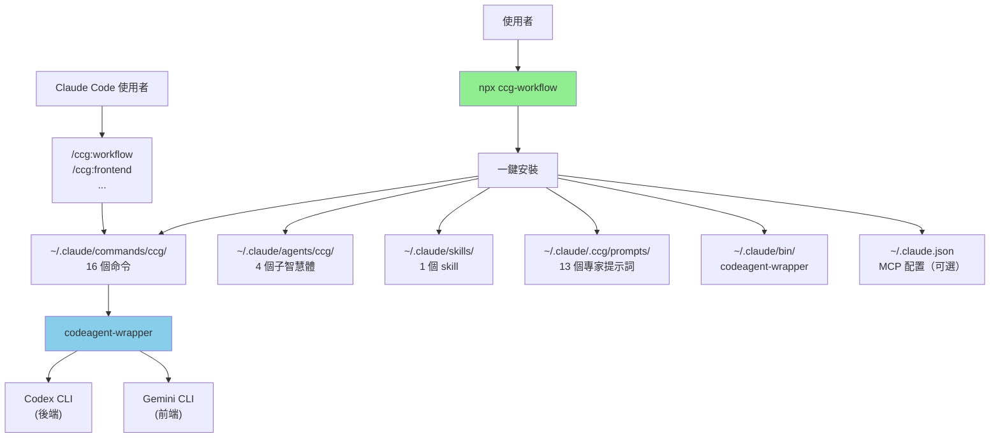

# skills-v2 (CCG Multi-Model Collaboration System)

> [根目錄](../CLAUDE.md) > **skills-v2**

**Last Updated**: 2026-03-31 (v2.1.11)

---

## 變更記錄 (Changelog)

> 完整變更歷史請檢視 [CHANGELOG.md](./CHANGELOG.md)

### 2026-03-31 (v2.1.11)
- 🐛 **更新後 MCP 提示詞顯示未配置**（#124）：`update` 無條件傳 `--skip-mcp` 導致 `mcpProvider` 被覆蓋，修復為從已有配置恢復
- ✨ **Impeccable 命令可選安裝**（#125）：init 新增 confirm 提示，20 個前端設計命令預設不安裝
- ✨ **X (Twitter) 社群入口**：README 加 `@CCG_Workflow` 徽章 + demo 推文 + Contact 區

### 2026-03-31 (v2.1.1)
- 🐛 **Skill Registry 命令 frontmatter 修復**：`generateCommandContent()` 生成的 27 個 command 檔案補上 YAML frontmatter，修復 CC 命令索引級聯失敗

### 2026-03-31 (v2.1.0)
- ✨ **模型路由可配置**（Issue #121）：init Step 2/4 選前端/後端模型（gemini/codex/claude），Gemini 型號可選
- ✨ **選單模型路由配置**：`6. 配置模型路由`，切換後自動重灌模板
- 🔄 **20+ 模板去硬編碼**：`--backend gemini`/`--backend codex` 替換為 `{{FRONTEND_PRIMARY}}`/`{{BACKEND_PRIMARY}}`
- 🔄 **`{{GEMINI_MODEL_FLAG}}` 安裝時替換**：不再留給執行時解釋

### 2026-03-31 (v2.0.0)
- ✨ **Skill Registry 機制**：SKILL.md frontmatter 驅動自動命令生成，新增技能只需寫一個 SKILL.md
- ✨ **域知識秘典全量匯入**：10 大領域 61 個知識檔案（安全/架構/DevOps/AI/開發/前端設計/基礎設施/移動端/資料工程/編排）
- ✨ **Impeccable 工具集**：20 個 UI/UX 精打磨技能（polish/audit/harden/clarify/critique 等）
- ✨ **Override-Refusal**：`/hi` 命令，會話級反拒絕覆寫器
- ✨ **Scrapling 技能**：網頁抓取，支援 Cloudflare/WAF 繞過
- ✨ **3 個新輸出風格**：冷刃簡報 + 鐵律軍令 + 祭儀長卷，總數 8 種
- 🏗 **`skill-registry.ts`**：新模組，frontmatter 解析 + 技能發現 + 命令生成

### 2026-03-30 (v1.8.3)
- ✨ **`/ccg:team` 統一工作流**：第 28 個斜槓命令，8 階段企業級工作流（需求→架構→規劃→開發→測試→審查→修復→整合），7 角色 Agent Teams 自動編排
- ✨ **3 個新 Agent**：`team-architect`（架構師）、`team-qa`（QA 工程師）、`team-reviewer`（程式碼審查員）
- ✨ **Evaluator-Optimizer 反饋環**：最多 2 輪自動修復 Critical 問題
- ✨ **多模型交叉**：架構階段 Codex∥Gemini 並行分析，審查階段雙模型交叉驗證

### 2026-03-27 (v1.8.2)
- 🐛 **Windows ccline 狀態列修復**：路徑從 `%USERPROFILE%` 改為 `~`，Claude Code 統一支援

### 2026-03-27 (v1.8.1)
- 🐛 **WORKDIR 路徑推斷修復**：20 個命令模板強制 `pwd`/`cd` 獲取工作目錄，禁止從 `$HOME` 推斷，修復沙箱/雲端環境路徑錯誤
- 🐛 **spec-init 目錄防禦**：Step 3 禁止 `cd` 到其他路徑
- 🐛 **Windows 相容**：WORKDIR 獲取支援 `pwd`（Unix）+ `cd`（Windows CMD）

### 2026-03-26 (v1.8.0)
- 🐛 **Gemini session_id 解析修復**：修復 Gemini CLI init 事件前 MCP 文字導致 JSON 解析失敗，恢復 session_id 捕獲
- 🐛 **Gemini 會話複用恢復**：所有模板恢復 `resume <SESSION_ID>`，支援並行多會話
- ✨ **spec-impl 跨階段會話複用**：原型→審查複用 `CODEX_PROTO_SESSION` / `GEMINI_PROTO_SESSION`

### 2026-03-26 (v1.7.97)
- 🐛 **Gemini `-p -` 顯示修正**：`Command:` 行顯示真實任務文字而非 `-p -`，消除誤導
- 🐛 **Session-ID 早期輸出**：wrapper 在 `session_started` 時立即輸出 `Session-ID:` 到 stderr，防止超時後 Claude 誤用 PID resume
- 🔄 **Binary 版本升級**：`5.8.0` → `5.9.0`

### 2026-03-25 (v1.7.92)
- ✨ **初始化互動重構**：3 步流程（API 提供方 → MCP 多選 → 效能模式），贊助商預留位，MCP 多選共存
- 🐛 **第三方 API 修復**：`ANTHROPIC_API_KEY` → `ANTHROPIC_AUTH_TOKEN`，修復 `/login` 問題
- 🐛 **Gemini CLI stdin 修復**：`-p -` → `-p "任務文字"`，修復 Gemini 無法呼叫

### 2026-03-25 (v1.7.91)
- 🐛 **Gemini CLI stdin 相容性修復**：`-p -` 改為 `-p "任務文字"` 直接傳遞，修復 Gemini 無法呼叫的問題

### 2026-03-23 (v1.7.90)
- ✨ **`--progress` 進度輸出**：codeagent-wrapper 新增 `--progress` 引數，後臺任務 stderr 輸出精簡進度行，告別黑箱等待（PR #112）
- 🐛 **全模板 `--progress` 覆蓋**：補漏 `debug.md`、`spec-review.md`、`codex-exec.md` review 呼叫

### 2026-03-20 (v1.7.89)
- 🐛 **許可權規則匹配修復**：`Bash(*codeagent-wrapper*)` 加前導萬用字元，修復 Windows/macOS 完整路徑不匹配
- 🐛 **spec-init `<<<` 攔截修復**：改用管道替代 here-string
- 🔄 **全平臺 permissions.allow**：macOS/Linux 不再依賴 Hook + jq，升級自動遷移清理

### 2026-03-19 (v1.7.88)
- 🐛 **TS 型別錯誤修復**：`installer-mcp.ts` 引數型別收緊為 `McpServerConfig`，修復 `tsc --noEmit` 報錯
- 🔄 **發版流程加固**：`pnpm typecheck` + `pnpm test` 列為發版必檢項

### 2026-03-19 (v1.7.87)
- 🐛 **Gemini 失敗重試**：20 個命令模板新增 Gemini 呼叫失敗重試規則（最多 2 次，間隔 5s），3 次全敗才降級單模型
- 🐛 **Codex 結果必須等待**：20 個命令模板新增 Codex 等待規則，禁止在 Codex 未返回時跳過下一階段
- 🐛 **team-exec Agent Teams 修正**：明確使用 TeamCreate + TaskCreate + Agent(team_name=...) 建立真正的 Agent Teams，禁止退化為普通 Agent

### 2026-03-18 (v1.7.86)
- 🐛 **Skills 路徑修正**：`SKILL.md` 中 `run_skill.js` 路徑從 `~/.claude/skills/` 修正為 `~/.claude/skills/ccg/`，對齊 v1.7.75 名稱空間遷移

### 2026-03-17 (v1.7.85)
- ✨ **Binary 雙源下載**：GitHub（8s 超時）→ Cloudflare R2 映象（60s），國內使用者友好
- 🐛 **更新跳過 binary 重複下載**：`preserveBinary` + `verifyBinary()` / `showBinaryDownloadWarning()`
- 🐛 **更新失敗顯示 binary 提示**：與初始化一致的紅框警告 + 手動修復指引

### 2026-03-12 (v1.7.83)
- 🔄 **安裝器重構**：1878 行單檔案 → 5 個聚焦模組（-25%），`cmd()` 構建器 + `MCP_PROVIDERS` 登錄檔 + 共享管線，零功能變更

### 2026-03-12 (v1.7.82)
- ✨ **fast-context MCP 整合**：Windsurf Fast Context 作為第四個程式碼檢索選項（推薦），支援 API Key 可選 + FC_INCLUDE_SNIPPETS
- ✨ **三端搜尋提示詞**：自動注入 Claude Code rules + Codex AGENTS.md + Gemini GEMINI.md，解除安裝自動清理
- ✨ **Gemini MCP 同步**：`syncMcpToGemini()` 映象 MCP 到 `~/.gemini/settings.json`

### 2026-03-11 (v1.7.81)
- 🔄 **`/ccg:commit` Context 自動歸檔**：從 git diff 自動生成 ContextEntry，不再依賴手動 session.log
- 🔄 **`/ccg:context log` 降為可選**：init 一次 → 正常開發 → commit 全自動

### 2026-03-11 (v1.7.80)
- ✨ **`/ccg:context` 命令**：第 27 個斜槓命令，`.context/` 目錄初始化 + 決策日誌 + 壓縮歸檔 + 歷史檢視
- ✨ **Context Compress Phase**：`/ccg:commit` 提交時自動壓縮 session.log → history/commits.jsonl
- ✨ **13 個角色提示詞 `.context Awareness`**：Codex/Gemini 提示詞注入 `.context/prefs/` 讀取指令
- ✨ **Quality Gate Rules**：`~/.claude/rules/ccg-skills.md` 定義質量關卡自動觸發規則，安裝時自動寫入

### 2026-03-11 (v1.7.79)
- 🐛 **Binary 下載容錯**：3 次重試 + 60s 超時 + 失敗醒目告警（紅框 + 手動修復指引）+ 不阻塞安裝
- 🐛 **Update 流程加固**：binary 備份/恢復 + subprocess 超時 120s→300s

### 2026-03-11 (v1.7.78)
- 🐛 **Windows Hook exit 255 修復**：Windows 自動授權改用 `permissions.allow`，不再依賴 jq/grep

### 2026-03-10 (v1.7.77)
- 🏗 **二進位制遷移至 GitHub Release**：npm 包 16.3MB→161KB，Actions CI 交叉編譯，installer 按需下載

### 2026-03-10 (v1.7.76)
- 📝 **README 重構**：命令分組（7 類）、新增 Why CCG? + CONTRIBUTING.md + Issue 模板 x3、配置章節去重摺疊

### 2026-03-10 (v1.7.75)
- 🐛 **Skills 名稱空間隔離**：`skills/` → `skills/ccg/`，解除安裝不再誤刪使用者自建 skill + 舊版自動遷移

### 2026-03-09 (v1.7.74)
- 🔄 **spec 模板 guardrail**：`spec-research`/`spec-plan`/`spec-impl` 新增 USER GUIDANCE RULE + TASKS FORMAT RULE，內部 `/opsx:*` 呼叫標註 internal，失敗引導至 `/ccg:spec-*`
- 🐛 **Gemini CLI `.env` 隔離**：`cmd.Dir=$HOME` + `--include-directories` 避免專案 `.env` 覆蓋全域性 API Key
- 🐛 **Codex 測試修正**：環境變數名 `CODEX_BYPASS_SANDBOX` → `CODEX_REQUIRE_APPROVAL`

### 2026-03-09 (v1.7.73)
- ✨ **`/ccg:codex-exec` 命令**：第 26 個斜槓命令，Codex 全權執行 + 多模型稽核，Claude token 極低消耗
- ✨ **Skills 體系**：6 個原生 skill（verify-security/quality/change/module + gen-docs + multi-agent）
- ✨ **context7 MCP 自動安裝**：免費庫文件查詢，無需 API Key
- ✨ **Codex MCP 同步**：`syncMcpToCodex()` 映象同步到 `~/.codex/config.toml`
- 🐛 **修復 `--skip-mcp` / 安裝解除安裝路徑 / 模板替換 / 計數 / 失敗反饋**

### 2026-03-09 (v1.7.70)
- ✨ **選單 UI 大改版**：ASCII Art Logo + 雙線邊框 + 編號快捷鍵 + CJK 寬度感知對齊
- 🔄 **MCP 推薦調整**：ace-tool 恢復為預設推薦（`enhance_prompt` 已不可用），中轉推薦 https://acemcp.heroman.wtf/
- 🗑️ **倉庫清理**：移除 11 個臨時/快取檔案，更新 `.gitignore`

### 2026-03-09 (v1.7.69)
- ✨ **國際化 (i18n)**：首次安裝語言選擇，CLI 全路徑 i18n 化，README 英文版
- ✨ **codeagent-wrapper Hook 自動授權**：解決 `permissions.allow` 不生效問題，需 `jq`

### 2026-03-09 (v1.7.68)
- 🐛 **修復 update 命令全域性安裝死迴圈**：npm 全域性安裝使用者本地工作流過舊時不再錯誤推薦 `npm install -g`
- ✅ **測試覆蓋率 38 → 130**：新增 version/config/platform/installer 四組測試，模板變數完整性檢查

### 2026-03-07 (v1.7.67)
- 🐛 **修復 spec 工作流完全對齊 OPSX**：修復狀態持久化問題，確保使用者切換上下文後可以正確恢復
- 🔄 **多模型協作成果採納**：在呼叫 OPSX 前輸出結構化總結，確保 Codex/Gemini 的分析結果被正確傳遞
- 🗑️ **移除 spec-init ace-tool 檢查**：ace-tool MCP 為可選項，不作為必需檢查

### 2026-03-06 (v1.7.66)
- 🐛 **修復 `spec-research` 並行呼叫缺失**：補全 Step 4 多模型並行探索模板，新增 `run_in_background: true` 和完整 Bash 並行呼叫示例

### 2026-03-01 (v1.7.63)
- 🔄 **適配 OpenSpec 1.2**：`spec-init` 支援 Profile 系統 + 自動檢測，`spec-review` 修復過時引用，保持 CCG 封裝純粹性

### 2026-02-27 (v1.7.62)
- 🔄 **Gemini 模型升級**：`gemini-3-pro-preview` → `gemini-3.1-pro-preview`（PR #65 by @23q3）

### 2026-02-10 (v1.7.60)
- ✨ **Agent Teams 系列**：新增 4 個獨立命令（`team-research`/`team-plan`/`team-exec`/`team-review`）
- 🏗️ **並行實施**：利用 Claude Code Agent Teams spawn Builder teammates 並行寫程式碼
- 📋 **完整鏈路**：需求→約束 → 消除歧義→計劃 → 並行實施 → 雙模型審查
- 🔒 **完全獨立**：Team 系列不依賴現有 ccg 命令，自成體系

### 2026-02-08 (v1.7.57)
- ✨ **MCP 工具擴充套件**：新增 ContextWeaver（推薦）+ 輔助工具（Context7/Playwright/DeepWiki/Exa）
- ✨ **API 配置**：初始化和選單新增 API 配置，自動新增最佳化配置和許可權白名單
- ✨ **實用工具**：新增 ccusage（用量分析）+ CCometixLine（狀態列）
- ✨ **Claude Code 安裝**：支援 npm/homebrew/curl/powershell/cmd 多種方式

### 2026-01-26 (v1.7.52)
- 🚀 **OpenSpec 升級**：遷移到 OPSX 架構，廢棄 `/openspec:xxx`，啟用 `/opsx:xxx`
- 🔄 **命令更新**：更新 `spec-*` 系列命令以支援新的 `/opsx` 命令
- 🗑️ **清理**：移除過時的 OpenSpec 指導塊和舊命令

### 2026-01-25 (v1.7.51)
- 🌏 **修復預設語言為英文的問題**：將 CLI 所有命令描述從硬編碼英文改為中文

### 2026-01-21 (v1.7.47)
- 🐛 **修復 `gemini/architect.md` 缺失**：新增前端架構師角色提示詞
- ✅ **專家提示詞數量**：12 → 13 個（Codex 6 + Gemini 7）

---

## 模組職責

**CCG (Claude + Codex + Gemini)** - 多模型協作系統的核心實現，提供：

1. **多模型協作編排**：固定路由 Gemini（前端）+ Codex（後端）+ Claude（編排）
2. **28+ 斜槓命令**：開發工作流 + Git 工具 + 專案管理 + OPSX + Agent Teams + Codex 執行 + Skill Registry 自動生成
3. **13 個專家提示詞**：Codex 6 個 + Gemini 7 個
4. **Skill Registry**：SKILL.md frontmatter 驅動，user-invocable 技能自動生成 slash commands
5. **100+ 技能檔案**：6 質量關卡 + 10 域知識秘典（61 檔案）+ 20 impeccable 工具 + scrapling + override-refusal
6. **跨平臺 CLI 工具**：一鍵安裝（支援 macOS、Linux、Windows）
7. **MCP 整合**：fast-context（推薦）/ ace-tool / ContextWeaver + context7（自動安裝）+ Codex & Gemini MCP 同步
8. **Agent Teams 並行實施**：Team 系列 4 個獨立命令，spawn Builder teammates 並行寫程式碼
9. **8 種輸出風格**：預設 + 專業工程師 + 貓娘 + 老王 + 大小姐 + 邪修 + 冷刃簡報 + 鐵律軍令 + 祭儀長卷

---

## 入口與啟動

### 使用者安裝入口

```bash
# 一鍵安裝（推薦）
npx ccg-workflow

# 互動式選單
npx ccg-workflow menu
```

### CLI 入口點

- **主入口**：`bin/ccg.mjs` → `src/cli.ts`
- **核心命令**：
  - `init` - 初始化工作流（`src/commands/init.ts`）
  - `update` - 更新工作流（`src/commands/update.ts`）
  - `menu` - 互動式選單（`src/commands/menu.ts`）
  - `diagnose-mcp` - MCP 診斷（`src/commands/diagnose-mcp.ts`）
  - `config` - 配置管理（`src/commands/config-mcp.ts`）

### codeagent-wrapper 入口

- **主入口**：`codeagent-wrapper/main.go`
- **呼叫語法**：
  ```bash
  codeagent-wrapper --backend <codex|gemini|claude> - [工作目錄] <<'EOF'
  <任務內容>
  EOF
  ```

---

## 對外介面

### CLI 命令介面

| 命令 | 用途 |
|------|------|
| `npx ccg-workflow` | 一鍵安裝/選單 |
| `npx ccg-workflow menu` | 互動式選單 |
| `npx ccg-workflow update` | 更新到最新版本 |
| `npx ccg-workflow diagnose-mcp` | 診斷 MCP 配置 |

### Slash Commands 介面（17 個）

**開發工作流**：
| 命令 | 用途 | 模型 |
|------|------|------|
| `/ccg:workflow` | 完整 6 階段工作流 | Codex ∥ Gemini |
| `/ccg:plan` | 多模型協作規劃（Phase 1-2） | Codex ∥ Gemini |
| `/ccg:execute` | 多模型協作執行（Phase 3-5） | Codex ∥ Gemini + Claude |
| `/ccg:codex-exec` | Codex 全權執行計劃（MCP + 程式碼 + 測試） | Codex + 多模型稽核 |
| `/ccg:context` | 專案上下文管理（.context 初始化/日誌/壓縮/歷史） | Claude |
| `/ccg:frontend` | 前端專項（快速模式） | Gemini |
| `/ccg:backend` | 後端專項（快速模式） | Codex |
| `/ccg:feat` | 智慧功能開發 | 規劃 → 實施 |
| `/ccg:analyze` | 技術分析（僅分析） | Codex ∥ Gemini |
| `/ccg:debug` | 問題診斷 + 修復 | Codex ∥ Gemini |
| `/ccg:optimize` | 效能最佳化 | Codex ∥ Gemini |
| `/ccg:test` | 測試生成 | 智慧路由 |
| `/ccg:review` | 程式碼審查（自動 git diff） | Codex ∥ Gemini |

**專案管理**：
| 命令 | 用途 |
|------|------|
| `/ccg:init` | 初始化專案 CLAUDE.md |

**Git 工具**：
| 命令 | 用途 |
|------|------|
| `/ccg:commit` | 智慧提交（conventional commit） |
| `/ccg:rollback` | 互動式回滾 |
| `/ccg:clean-branches` | 清理已合併分支 |
| `/ccg:worktree` | Worktree 管理 |

**Agent Teams 並行實施**（v1.7.60+，需啟用 `CLAUDE_CODE_EXPERIMENTAL_AGENT_TEAMS=1`）：
| 命令 | 用途 | 說明 |
|------|------|------|
| `/ccg:team` | **統一工作流（推薦）** | 8 階段全流程：需求→架構→規劃→開發→測試→審查→修復→整合，7 角色自動編排 |
| `/ccg:team-research` | 需求 → 約束集 | 並行探索程式碼庫，Codex + Gemini 雙模型分析 |
| `/ccg:team-plan` | 約束 → 並行計劃 | 消除歧義，拆分為檔案範圍隔離的獨立子任務 |
| `/ccg:team-exec` | 並行實施 | spawn Builder teammates（Sonnet）並行寫程式碼 |
| `/ccg:team-review` | 雙模型審查 | Codex + Gemini 交叉審查，分級處理 Critical/Warning/Info |

---

## 固定 / 可配置項

| 專案 | 預設值 | 可配置 | 說明 |
|------|--------|--------|------|
| 語言 | 中文 | ✗ | 所有模板為中文 |
| 前端模型 | Gemini | ✓ (v2.1.0+) | init Step 2/4 / 選單 6 |
| 後端模型 | Codex | ✓ (v2.1.0+) | init Step 2/4 / 選單 6 |
| Gemini 型號 | gemini-3.1-pro-preview | ✓ (v2.1.0+) | 選 gemini 時可配 |
| 協作模式 | smart | ✗ | 最佳實踐 |
| 命令數量 | 28 個 | ✗ | 全部安裝 |

---

## 關鍵依賴與配置

### TypeScript 依賴

**執行時依賴**：
- `cac@^6.7.14` - CLI 框架
- `inquirer@^12.9.6` - 互動式提示
- `ora@^9.0.0` - 載入動畫
- `ansis@^4.1.0` - 終端顏色
- `fs-extra@^11.3.2` - 檔案系統工具
- `smol-toml@^1.4.2` - TOML 解析

**開發依賴**：
- `typescript@^5.9.2`
- `unbuild@^3.6.1` - 構建工具
- `tsx@^4.20.5` - TypeScript 執行器

### Go 依賴

- Go 標準庫（無外部第三方依賴）

### 配置檔案

**使用者配置**：
- `~/.claude/.ccg/config.toml` - CCG 主配置

**MCP 配置**：
- `~/.claude.json` - Claude Code MCP 服務配置

---

## 相關檔案清單

### 核心原始碼

```
src/
├── cli.ts                     # CLI 入口
├── cli-setup.ts               # 命令註冊
├── commands/
│   ├── init.ts                # 初始化命令
│   ├── update.ts              # 更新命令
│   ├── menu.ts                # 互動式選單
│   └── ...
├── utils/
│   ├── installer.ts           # 安裝邏輯（核心）
│   ├── config.ts              # 配置管理
│   ├── mcp.ts                 # MCP 工具整合
│   └── ...
```

### 模板檔案

```
templates/
├── commands/                  # 27 個斜槓命令
│   ├── workflow.md
│   ├── plan.md                # 多模型協作規劃
│   ├── execute.md             # 多模型協作執行
│   ├── codex-exec.md          # Codex 全權執行計劃
│   ├── context.md             # 專案上下文管理（.context）
│   ├── frontend.md
│   ├── backend.md
│   ├── feat.md
│   ├── analyze.md
│   ├── debug.md
│   ├── optimize.md
│   ├── test.md
│   ├── review.md
│   ├── init.md
│   ├── commit.md
│   ├── rollback.md
│   ├── clean-branches.md
│   ├── worktree.md
│   ├── team-research.md       # Agent Teams 需求→約束
│   ├── team-plan.md           # Agent Teams 規劃
│   ├── team-exec.md           # Agent Teams 並行實施
│   ├── team-review.md         # Agent Teams 審查
│   └── agents/               # 4 個子智慧體
│       ├── planner.md
│       ├── ui-ux-designer.md
│       ├── init-architect.md
│       └── get-current-datetime.md
├── prompts/                  # 13 個專家提示詞
│   ├── codex/
│   └── gemini/
└── skills/                   # 100+ 技能檔案（質量關卡 + 域知識 + impeccable + 工具）
    ├── tools/
    │   ├── verify-security/
    │   ├── verify-quality/
    │   ├── verify-change/
    │   ├── verify-module/
    │   ├── gen-docs/
    │   ├── override-refusal/  # /hi 反拒絕覆寫器
    │   └── lib/
    ├── domains/              # 10 大領域知識秘典（61 檔案）
    │   ├── security/         # 紅隊/藍隊/滲透/審計/逆向/威脅情報
    │   ├── architecture/     # API/快取/雲原生/訊息佇列/安全架構
    │   ├── devops/           # Git/測試/資料庫/效能/可觀測性
    │   ├── ai/               # Agent/RAG/LLM安全/Prompt工程
    │   ├── development/      # Go/Python/Rust/TS/Java/C++/Shell
    │   ├── frontend-design/  # UI美學/元件/UX + 4種設計風格
    │   ├── infrastructure/
    │   ├── mobile/
    │   ├── data-engineering/
    │   └── orchestration/
    ├── impeccable/           # 20 個 UI/UX 精打磨技能
    ├── scrapling/            # 網頁抓取技能
    └── orchestration/
        └── multi-agent/
├── rules/                    # 全域性規則（→ ~/.claude/rules/）
│   └── ccg-skills.md         # 質量關卡自動觸發規則
```

### 預編譯產物

```
bin/
├── ccg.mjs                           # CLI 入口指令碼
├── codeagent-wrapper-darwin-amd64    # macOS Intel
├── codeagent-wrapper-darwin-arm64    # macOS Apple Silicon
├── codeagent-wrapper-linux-amd64     # Linux x64
├── codeagent-wrapper-linux-arm64     # Linux ARM64
├── codeagent-wrapper-windows-amd64.exe  # Windows x64
└── codeagent-wrapper-windows-arm64.exe  # Windows ARM64
```

---

## 架構圖



---

## 發版規則（必須嚴格遵守）

每次發版必須完成以下所有步驟，缺一不可：

### 1. 更新版本號
- 編輯 `package.json` 中的 `version` 欄位

### 2. 更新 CHANGELOG.md
- 在頂部新增新版本條目
- 格式：`## [x.y.z] - YYYY-MM-DD`
- 按類別分組：`✨ 新功能` / `🐛 修復` / `🔄 變更` / `🗑️ 移除`

### 3. 更新 README.md
- 更新命令表（如有新增命令）
- 更新使用說明（如有新功能）
- 更新底部版本號

### 4. 更新 CLAUDE.md
- 更新頂部 `Last Updated` 日期和版本號
- 新增變更記錄條目
- 更新命令數量、介面表等受影響的章節

### 5. 構建 + 釋出 + 推送

```bash
# 型別檢查（必須在 build 之前透過）
pnpm typecheck

# 構建
pnpm build

# 測試
pnpm test

# 釋出 npm 包
npm publish

# 提交到 Git
git add -A
git commit -m "chore: bump version to x.y.z"
git push origin main
```

### 檢查清單
- [ ] package.json 版本號已更新
- [ ] CHANGELOG.md 已新增新版本條目
- [ ] README.md 已更新（命令表 + 使用說明 + 底部版本號）
- [ ] CLAUDE.md 已更新（Last Updated + 變更記錄 + 受影響章節）
- [ ] **⚠ 若修改了 `codeagent-wrapper/` 下的 Go 程式碼，必須同步 bump 兩處版本號：**
  - [ ] `codeagent-wrapper/main.go` → `version = "x.y.z"`
  - [ ] `src/utils/installer.ts` → `EXPECTED_BINARY_VERSION = 'x.y.z'`
  - 兩邊版本必須一致，否則使用者 update 時無法觸發 binary 重新下載
  - **⛔ 禁止手動 `gh release upload`！** 推送 Go 程式碼後 CI（`.github/workflows/build-binaries.yml`）會自動編譯 + 上傳 GitHub Release + 同步 Cloudflare R2 映象。手動上傳會覆蓋 CI 產物且 R2 不會同步
- [ ] `pnpm typecheck` 透過（tsc --noEmit，不可跳過）
- [ ] `pnpm build` 透過
- [ ] `pnpm test` 透過
- [ ] `npm publish` 成功
- [ ] `git push origin main` 成功

---

**掃描覆蓋率**: 95%+
**最後更新**: 2026-02-10
